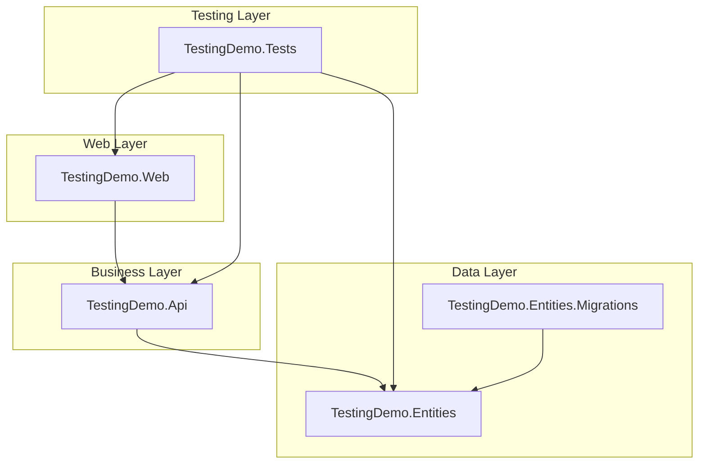
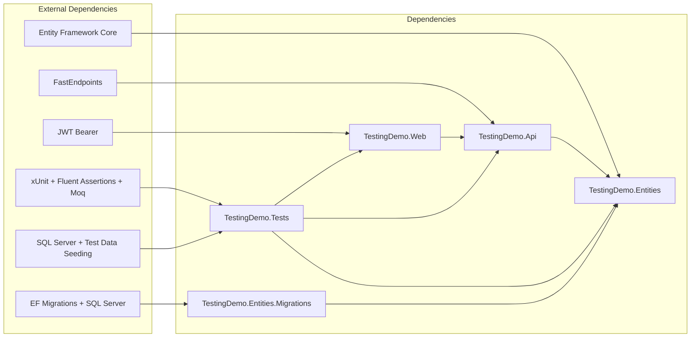

# TestingDemo

A comprehensive .NET 9 testing demonstration project showcasing integration testing with xUnit, Entity Framework Core In-Memory database, and modern .NET patterns.

## Project Architecture

This solution demonstrates Clean Architecture principles with a clear separation of concerns across multiple projects:

### 🏗️ Project Structure

#### 📁 **TestingDemo.Web** (Presentation Layer)
- **Purpose**: Web API host and configuration
- **Key Components**:
  - `Program.cs` - Application bootstrap and service configuration
  - JWT Authentication setup
  - Dependency injection container configuration
  - FastEndpoints integration
  - OpenAPI/Swagger configuration
- **Dependencies**: References `TestingDemo.Api`

#### 📁 **TestingDemo.Api** (Business Logic Layer)
- **Purpose**: API endpoints, business logic, and application services
- **Key Components**:
  - **CQRS Pattern Implementation**:
    - `Users/Commands/` - Create, Update, Delete user operations
    - `Users/Queries/` - Get user(s) operations
  - **FastEndpoints Implementation** - Modern alternative to Controllers
  - **Services**:
    - `IEmailService` & `EmailService` - Email notifications
  - **Validation** - FluentValidation rules
  - **Authorization** - Role-based access control
- **Dependencies**: References `TestingDemo.Entities`
- **Technologies**: FastEndpoints, FluentValidation, Entity Framework Core

#### 📁 **TestingDemo.Entities** (Data Access Layer)
- **Purpose**: Data models, database context, and entity configurations
- **Key Components**:
  - **Models**:
    - `User` - User entity with role-based access
    - `Dashboard` - Dashboard entity
    - `UserDashboard` - Many-to-many relationship entity
  - **Database Context**:
    - `DemoDbContext` - EF Core DbContext implementing `IDemoDbContext`
    - Entity configurations for database mapping
  - **Repository Pattern**: `IDemoDbContext` interface for data access abstraction
- **Technologies**: Entity Framework Core, SQL Server provider

#### 📁 **TestingDemo.Entities.Migrations** (Database Migration & Schema Management)
- **Purpose**: SQL Server database migrations and database object synchronization
- **Key Components**:
  - **Entity Framework Migrations**: Database schema versioning and updates
  - **Database Object Synchronization**:
    - `SyncService` - Service for synchronizing stored procedures, functions, and views
    - `DbContextExtensions` - Extension methods for easy integration
    - `DatabaseObjectSyncResult` - Result tracking for sync operations
  - **Embedded SQL Resources**:
    - `StoredProcedures/` - SQL stored procedure definitions as embedded resources
    - `Views/` - SQL view definitions as embedded resources
    - `Functions/` - SQL function definitions as embedded resources (folder structure ready)
  - **Features**:
    - Automatic synchronization of database objects from embedded SQL files
    - Support for CREATE/ALTER operations based on existing database state
    - Cleanup of orphaned database objects not present in source files
    - Comprehensive logging and error handling
    - SQL batch execution support (handles GO statements)
- **Dependencies**: References `TestingDemo.Entities`
- **Technologies**: Entity Framework Core Migrations, SQL Server provider, embedded resources

#### 📁 **TestingDemo.Tests** (Testing Layer)
- **Purpose**: Comprehensive integration and unit testing suite
- **Key Components**:
  - **Custom Test Infrastructure**:
    - `TestingDemoWebApplicationFactory` - Custom WebApplicationFactory for integration tests
    - `TestingFactory` - Helper factory for test session creation
    - `TestUsers` - Predefined test user data with Admin and User roles
    - `TestingSeed` - Database seeding service for test data initialization
    - `HttpExtensions` - HTTP helper methods for testing
  - **Test Data Management**:
    - Automated test database seeding with predefined users and dashboards
    - SQL Server identity insert handling for consistent test data IDs
    - Test user scenarios including active/inactive states and role-based testing
  - **Test Categories**:
    - User CRUD operations testing
    - Authentication & Authorization testing
    - Validation testing with various scenarios
    - Email service mocking and verification
    - Database state verification
- **Testing Stack**: xUnit, Fluent Assertions, Moq for mocking, ASP.NET Core Testing framework
- **Database**: Entity Framework UseSqlServer provider with dedicated test database and automated seeding

### 🔗 Dependency Flow

## 🚀 Key Features Demonstrated

### Clean Architecture Patterns
- **Separation of Concerns**: Each project has a single responsibility
- **Dependency Inversion**: Higher layers depend on abstractions, not implementations
- **Repository Pattern**: Data access abstraction through `IDemoDbContext`
- **CQRS Pattern**: Commands and Queries separated for better maintainability

### Modern .NET Patterns
- **FastEndpoints**: Alternative to traditional MVC controllers
- **Minimal APIs Integration**: Leveraging .NET's modern API patterns
- **JWT Authentication**: Secure, stateless authentication
- **Role-based Authorization**: Admin/User role separation
- **Dependency Injection**: Native .NET DI container usage

### Database Management & Migrations
- **Entity Framework Migrations**: Schema versioning and automated updates
- **Database Object Synchronization**: Automated sync of stored procedures, views, and functions
- **Embedded Resources Pattern**: SQL objects stored as embedded resources for deployment consistency
- **SQL Server Integration**: Full SQL Server feature support including advanced database objects
- **Migration Safety**: Comprehensive error handling and rollback capabilities

### Comprehensive Testing Strategy
- **Integration Testing**: Full HTTP request/response testing
- **Test Data Management**: Consistent test user setup with automated seeding
- **Database Integration**: SQL Server database for realistic testing scenarios
- **Service Mocking**: Mocking external services (email)
- **Authentication Testing**: Authorized and unauthorized scenarios
- **Validation Testing**: Comprehensive input validation scenarios

### Testing Best Practices
- **AAA Pattern**: Arrange, Act, Assert structure
- **Descriptive Test Names**: Clear intent and expected behavior
- **Theory-based Testing**: Parameterized tests for multiple scenarios
- **Custom Test Infrastructure**: Reusable test setup and utilities
- **Environment Isolation**: Separate testing environment configuration
- **Test Data Seeding**: Automated database initialization with consistent test data
- **SQL Server Testing**: Full database integration testing with dedicated test database

## 🛠️ Technologies & Frameworks

- **.NET 9**: Latest .NET runtime
- **Entity Framework Core 9**: ORM with SQL Server and In-Memory providers
- **Entity Framework Migrations**: Database schema management and versioning
- **FastEndpoints**: High-performance API endpoint framework
- **xUnit**: Testing framework
- **Fluent Assertions**: Fluent assertion library
- **Moq**: Mocking framework
- **JWT Bearer Authentication**: Secure API authentication
- **FluentValidation**: Input validation framework
- **SQL Server**: Production database with full stored procedure/view/function support

## 📚 Learning Resources

- [Clean Architecture](https://jpnt.github.io/posts/dotnet8-clean-architecture-setup/)
- [Fast Endpoints](http://fast-endpoints.com/)
- [Fluent Assertions](https://fluentassertions.com)
- [Entity Framework Migrations](https://docs.microsoft.com/en-us/ef/core/managing-schemas/migrations/)
- [Shouldly](https://docs.shouldly.org/)
