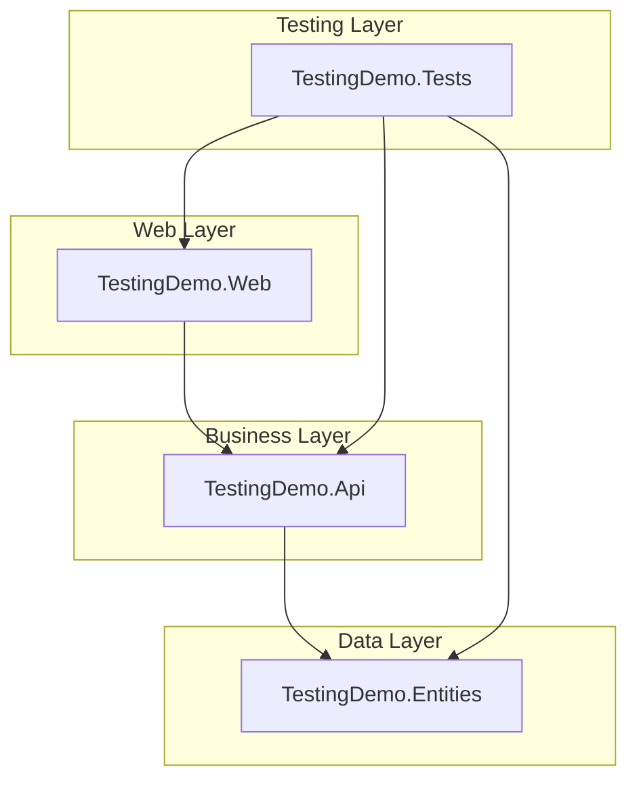
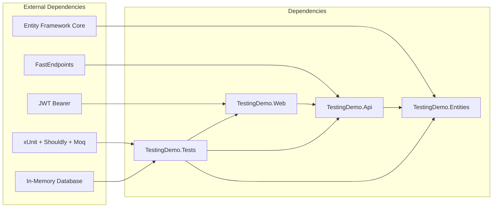

# TestingDemo

A comprehensive .NET 9 testing demonstration project showcasing integration testing with xUnit, Entity Framework Core In-Memory database, and modern .NET patterns.

## Project Architecture

This solution demonstrates Clean Architecture principles with a clear separation of concerns across multiple projects:

### 🏗️ Project Structure

#### 📁 **TestingDemo.Web** (Presentation Layer)
- **Purpose**: Web API host and configuration
- **Key Components**:
  - `Program.cs` - Application bootstrap and service configuration
  - JWT Authentication setup
  - Dependency injection container configuration
  - FastEndpoints integration
  - OpenAPI/Swagger configuration
- **Dependencies**: References `TestingDemo.Api`

#### 📁 **TestingDemo.Api** (Business Logic Layer)
- **Purpose**: API endpoints, business logic, and application services
- **Key Components**:
  - **CQRS Pattern Implementation**:
    - `Users/Commands/` - Create, Update, Delete user operations
    - `Users/Queries/` - Get user(s) operations
  - **FastEndpoints Implementation** - Modern alternative to Controllers
  - **Services**:
    - `IEmailService` & `EmailService` - Email notifications
  - **Validation** - FluentValidation rules
  - **Authorization** - Role-based access control
- **Dependencies**: References `TestingDemo.Entities`
- **Technologies**: FastEndpoints, FluentValidation, Entity Framework Core

#### 📁 **TestingDemo.Entities** (Data Access Layer)
- **Purpose**: Data models, database context, and entity configurations
- **Key Components**:
  - **Models**:
    - `User` - User entity with role-based access
    - `Dashboard` - Dashboard entity
    - `UserDashboard` - Many-to-many relationship entity
  - **Database Context**:
    - `DemoDbContext` - EF Core DbContext implementing `IRepository`
    - Entity configurations for database mapping
  - **Repository Pattern**: `IRepository` interface for data access abstraction
- **Technologies**: Entity Framework Core, SQL Server provider

#### 📁 **TestingDemo.Tests** (Testing Layer)
- **Purpose**: Comprehensive integration and unit testing suite
- **Key Components**:
  - **Custom Test Infrastructure**:
    - `TestingDemoWebApplicationFactory` - Custom WebApplicationFactory for integration tests
    - `TestingFactory` - Helper factory for test session creation
    - `TestUsers` - Predefined test user data
    - `HttpExtensions` - HTTP helper methods for testing
  - **Test Categories**:
    - User CRUD operations testing
    - Authentication & Authorization testing
    - Validation testing with various scenarios
    - Email service mocking and verification
    - Database state verification
- **Testing Stack**: xUnit, Shouldly assertions, Moq for mocking, ASP.NET Core Testing framework
- **Database**: Entity Framework In-Memory provider for isolated testing

### 🔗 Dependency Flow

## 🚀 Key Features Demonstrated

### Clean Architecture Patterns
- **Separation of Concerns**: Each project has a single responsibility
- **Dependency Inversion**: Higher layers depend on abstractions, not implementations
- **Repository Pattern**: Data access abstraction through `IRepository`
- **CQRS Pattern**: Commands and Queries separated for better maintainability

### Modern .NET Patterns
- **FastEndpoints**: Alternative to traditional MVC controllers
- **Minimal APIs Integration**: Leveraging .NET's modern API patterns
- **JWT Authentication**: Secure, stateless authentication
- **Role-based Authorization**: Admin/User role separation
- **Dependency Injection**: Native .NET DI container usage

### Comprehensive Testing Strategy
- **Integration Testing**: Full HTTP request/response testing
- **Test Data Management**: Consistent test user setup
- **Database Isolation**: In-memory database for clean testing
- **Service Mocking**: Mocking external services (email)
- **Authentication Testing**: Authorized and unauthorized scenarios
- **Validation Testing**: Comprehensive input validation scenarios

### Testing Best Practices
- **AAA Pattern**: Arrange, Act, Assert structure
- **Descriptive Test Names**: Clear intent and expected behavior
- **Theory-based Testing**: Parameterized tests for multiple scenarios
- **Custom Test Infrastructure**: Reusable test setup and utilities
- **Environment Isolation**: Separate testing environment configuration

## 🛠️ Technologies & Frameworks

- **.NET 9**: Latest .NET runtime
- **Entity Framework Core 9**: ORM with SQL Server and In-Memory providers
- **FastEndpoints**: High-performance API endpoint framework
- **xUnit**: Testing framework
- **Shouldly**: Fluent assertion library
- **Moq**: Mocking framework
- **JWT Bearer Authentication**: Secure API authentication
- **FluentValidation**: Input validation framework

## 📚 Learning Resources

- [Clean Architecture](https://jpnt.github.io/posts/dotnet8-clean-architecture-setup/)
- [Fast Endpoints](http://fast-endpoints.com/)
- [Shouldly](https://docs.shouldly.org/)
- [Fluent Assertions](https://fluentassertions.com)
