# 🧪 Testing Architecture - TestingDemo

This document explains how the TestingDemo project uses WebApplicationFactory for comprehensive integration testing, including the complete flow from test initialization through execution.

## 📋 Table of Contents
- [Testing Flow Diagram](#-testing-flow-diagram)
- [Key Components](#-key-components-explained)
- [Project Structure](#-project-structure)
- [Test Execution Pattern](#-test-execution-pattern)
- [Common Test Scenarios](#-common-test-scenarios)
- [Benefits](#-benefits-of-this-architecture)
- [Running Tests](#-running-tests)

## 🔄 Testing Flow Diagram

```mermaid
graph TD
    %% Test Initiation
    A[Test Method Starts] --> B{Test Type?}
    B -->|Anonymous| C[TestingFactory.CreateAnonymousAsync]
    B -->|Authenticated| D[TestingFactory.CreateForUserAsync]
    
    %% Factory Creation
    C --> E[Create TestingDemoWebApplicationFactory]
    D --> E
    E --> F[Configure Web Host]
    F --> G[Set Environment = 'Testing']
    F --> H[Apply Service Overrides]
    
    %% Database Initialization (One-time per test run)
    E --> I{Database Initialized?}
    I -->|No| J[Acquire Semaphore Lock]
    I -->|Yes| S[Create TestingInstance]
    
    J --> K[Get Connection String from appsettings.Testing.json]
    K --> L[Create DbContext with SQL Server]
    L --> M[Drop Existing Database]
    M --> N[Run EF Migrations]
    N --> O[Sync SQL Objects<br/>Stored Procs, Views, Functions]
    O --> P[Seed Database via TestingSeed]
    
    %% Database Seeding
    P --> Q[Seed Users from TestUsers.All]
    Q --> R[Seed Dashboards]
    R --> S
    
    %% TestingInstance Creation
    S --> T[Create TestingInstance Object]
    T --> U[Set WebApplicationFactory Reference]
    T --> V{User Provided?}
    V -->|Yes| W[Set User Property]
    V -->|No| X[Leave User as null]
    W --> Y[Return TestingInstance]
    X --> Y
    
    %% Test Execution
    Y --> Z[Test Uses session.Api Property]
    Z --> AA[TestingInstance.Api getter called]
    AA --> BB[Create HttpClient from Factory]
    BB --> CC{User Present?}
    CC -->|Yes| DD[Generate JWT Token]
    CC -->|No| EE[Return Unauthenticated Client]
    
    DD --> FF[Add Claims: Sub, Email, Role, Jti]
    FF --> GG[Sign with HMAC SHA256]
    GG --> HH[Set Authorization Header]
    HH --> II[Return Authenticated HttpClient]
    
    EE --> JJ[Execute HTTP Request]
    II --> JJ
    
    %% Database Verification
    JJ --> KK[Test May Access session.DbContext]
    KK --> LL[Create New Scope]
    LL --> MM[Get Fresh DbContext Instance]
    MM --> NN[Verify Database State]
    
    %% Cleanup
    NN --> OO[Test Completes]
    OO --> PP[Dispose TestingInstance]
    PP --> QQ[WebApplicationFactory Disposed]

    %% Styling
    classDef factory fill:#e1f5fe,stroke:#0277bd,stroke-width:2px
    classDef database fill:#f3e5f5,stroke:#7b1fa2,stroke-width:2px
    classDef auth fill:#fff3e0,stroke:#f57c00,stroke-width:2px
    classDef test fill:#e8f5e8,stroke:#388e3c,stroke-width:2px
    
    class E,F,G,H,T,U factory
    class I,J,K,L,M,N,O,P,Q,R,KK,LL,MM,NN database
    class CC,DD,FF,GG,HH,II auth
    class A,Y,Z,JJ,OO,PP,QQ test
```



## 📁 Project Structure

```
TestingDemo.Tests/
├── Users/
│   ├── CreateUserTests.cs      # User creation endpoint tests
│   ├── GetUsersTests.cs        # User retrieval endpoint tests
│   └── DeleteUserTests.cs      # User deletion endpoint tests
├── TestingFactory.cs           # Main factory for creating test instances
├── TestingDemoWebApplicationFactory.cs  # Custom WebApplicationFactory
├── TestingInstance.cs          # Test session wrapper
├── TestUsers.cs                # Predefined test user data
├── TestingSeed.cs              # Database seeding logic
└── TESTING_README.md           # This documentation
```

## 🔧 Key Components Explained

### 1. **TestingDemoWebApplicationFactory**
- Inherits from `WebApplicationFactory<Program>`
- Configures environment as "Testing"
- Allows service collection overrides for mocking

### 2. **TestingFactory** 
- Static factory with two creation methods:
  - `CreateAnonymousAsync()` - For unauthenticated tests
  - `CreateForUserAsync(User)` - For authenticated tests with specific user
- Handles database initialization with singleton pattern and semaphore locking
- Ensures database is created only once per test run

### 3. **Database Initialization Process**
- Uses SQL Server with dedicated test database
- Drops and recreates database for clean state
- Runs EF Core migrations
- Syncs stored procedures, views, and functions
- Seeds with predefined test data via `TestingSeed`

### 4. **Test Data Setup**
- **TestUsers**: Predefined users (Admin1, User5, InactiveUser10, etc.)
- **TestingSeed**: Seeds both users and dashboards
- Uses Identity Insert to maintain consistent test data IDs

### 5. **TestingInstance**
- Encapsulates test session state
- Provides `Api` property for HTTP client with optional JWT authentication
- Provides `DbContext` property for database verification
- Implements IDisposable for proper cleanup

### 6. **Authentication Flow**
- JWT tokens generated with predefined secret
- Claims include: Subject (UserId), Email, Role, JTI
- Tokens valid for 1 hour with HMAC SHA256 signing
- Authorization header automatically set on HttpClient

## 📝 Test Execution Pattern

### Typical Test Structure
```csharp
// Arrange
using var session = await TestingFactory.CreateForUserAsync(TestUsers.Admin1);
var command = new CreateUserCommand { /* ... */ };

// Act  
var response = await session.Api.PostAsJsonAsync("/api/users", command);

// Assert
response.StatusCode.ShouldBe(HttpStatusCode.Created);

// Optional: Verify database state
using var dbContext = session.DbContext;
var user = await dbContext.Users.FirstOrDefaultAsync(u => u.Email == command.Email);
user.ShouldNotBeNull();
```

## 🎯 Common Test Scenarios

### Anonymous Access Testing
```csharp
[Fact]
public async Task Anonymous_ShouldFail()
{
    // Arrange
    using var session = await TestingFactory.CreateAnonymousAsync();

    // Act
    var response = await session.Api.PostAsJsonAsync("/api/users", new { });

    // Assert
    response.StatusCode.ShouldBe(HttpStatusCode.Unauthorized);
}
```

### Role-Based Authorization Testing
```csharp
[Fact]
public async Task AsUser_ShouldFail()
{
    // Arrange - Regular user trying admin operation
    using var session = await TestingFactory.CreateForUserAsync(TestUsers.User5);

    // Act
    var response = await session.Api.PostAsJsonAsync("/api/users", command);

    // Assert
    response.StatusCode.ShouldBe(HttpStatusCode.Forbidden);
}
```

### Service Mocking with Dependency Injection
```csharp
[Fact]
public async Task AsAdmin_ShouldSendEmail()
{
    // Arrange - Mock email service
    var emailService = new Mock<IEmailService>();
    using var session = await TestingFactory.CreateForUserAsync(TestUsers.Admin1, services =>
    {
        services.AddSingleton(emailService.Object);
    });

    // Act & Assert
    await session.Api.PostAsJsonAsync("/api/users", command);
    emailService.Verify(e => e.SendEmailAsync(It.IsAny<MailMessage>(), It.IsAny<CancellationToken>()), Times.Once);
}
```

### Database State Verification
```csharp
[Fact]
public async Task CreateAdmin_ShouldAssignDefaultDashboards()
{
    // Arrange
    using var session = await TestingFactory.CreateForUserAsync(TestUsers.Admin1);

    // Act
    await session.Api.PostAsJsonAsync("/api/users", command);

    // Assert - Verify database changes
    using var dbContext = session.DbContext;
    var dashboards = await dbContext.Users
        .Include(u => u.Dashboards)
        .Where(u => u.Email == command.Email)
        .Select(e => e.Dashboards)
        .ToListAsync();
    dashboards.ShouldNotBeNull();
}
```

## ✅ Benefits of This Architecture

1. **Fast Test Execution**: Database created once, shared across tests
2. **Realistic Testing**: Full HTTP pipeline with actual controllers and middleware
3. **Flexible Authentication**: Easy switching between anonymous and authenticated contexts
4. **Service Mocking**: Ability to override services (e.g., IEmailService for testing notifications)
5. **Clean State**: Fresh HttpClient and DbContext for each test operation
6. **Comprehensive Coverage**: Tests authorization, validation, business logic, and data persistence

This architecture enables thorough integration testing while maintaining good performance and test isolation.

## 🚀 Running Tests

### Prerequisites
- .NET 8.0 SDK
- SQL Server (LocalDB or full instance)
- Visual Studio 2022 or VS Code with C# extension

### Command Line
```bash
# Run all tests
dotnet test

# Run specific test class
dotnet test --filter "FullyQualifiedName~CreateUserTests"

# Run with detailed output
dotnet test --verbosity normal

# Generate coverage report
dotnet test --collect:"XPlat Code Coverage"
```

### Visual Studio
- Use Test Explorer to run individual tests or test classes
- Set breakpoints in test methods for debugging
- View test output and results in the Test Explorer window

### Test Database Configuration
The test database connection is configured in `appsettings.Testing.json`:
```json
{
  "ConnectionStrings": {
    "DefaultConnection": "Server=(localdb)\\mssqllocaldb;Database=TestingDemoTest;..."
  }
}
```

### Debugging Tests
1. Set breakpoints in your test methods or the code being tested
2. Right-click the test and select "Debug Test"
3. Use the debugger to step through the WebApplicationFactory pipeline
4. Inspect database state using the `session.DbContext` property

---

## 📚 Additional Resources
- [ASP.NET Core Integration Testing](https://docs.microsoft.com/en-us/aspnet/core/test/integration-tests)
- [WebApplicationFactory Documentation](https://docs.microsoft.com/en-us/dotnet/api/microsoft.aspnetcore.mvc.testing.webapplicationfactory-1)
- [xUnit Testing Framework](https://xunit.net/)
- [FluentAssertions](https://fluentassertions.com/)
- [Moq Mocking Framework](https://github.com/moq/moq4)
